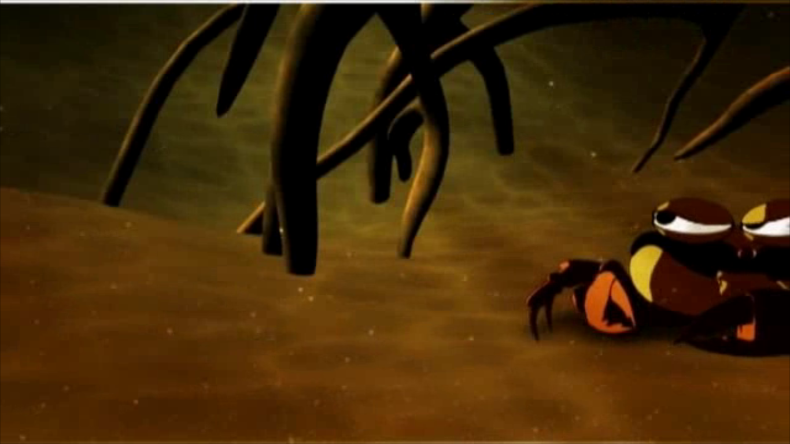

# A_Onda

> App educacional interativo de TV Digital sobre a Amazônia (biodiversidade, lendas e turismo). · PUC-Rio / Laboratório TeleMídia — trabalho da disciplina "Fundamentos de Sistemas Multimídia", semestre 2010.2 · 2010

## O que é
Aplicação NCL (perfil NCL 3.0 EDTVProfile) construída sobre um vídeo principal (`media/A_Onda.mp4`, ~140 MB) com pontos de interatividade ancorados em trechos do vídeo (`<area>`): comercial de viagem, vacina do Ministério da Saúde, conteúdo sobre o candiru, menu interativo e um quiz. A navegação usa regiões, descritores, transições de fade e uma `ruleBase` que seleciona conteúdo (incluindo pacotes turísticos por estado/CEP via `user.location`, com faixas para SP, RJ e BH). A interatividade é organizada por conectores causais (`A_Onda_ConnectorBase.ncl`) e o quiz é implementado em Lua (`media/lua/quiz.lua`, NCLua), com sub-aplicações para segunda tela em `NCLApplications/A_Onda/`. É autocontido: todas as mídias (vídeo, imagens, textos, fonte e scripts Lua) são locais.

## Como rodar
```bash
cd A_Onda
ginga A_Onda.ncl
```
Dica: adicione `-f` (tela cheia) ou `-s 960x540` (tamanho da janela).

## O que você deve ver
Sobe sem erro e exibe a vinheta de abertura com o texto "APRESENTA", iniciando a reprodução do vídeo/áudio (gstreamer em PLAYING). A interatividade (menu, quiz, pacotes por CEP) aparece em pontos específicos do vídeo, ancorada nas `<area>` definidas (por exemplo, candiru em ~350s, menu em ~395s, quiz em ~480s, créditos em ~740s).



## Status da verificação
Testado em **2026-06-24** · Ginga (telemidia/ginga, C++) · Ubuntu 22.04
- ✅ Roda — carrega o documento, exibe a vinheta de abertura ("APRESENTA") e inicia vídeo/áudio (gstreamer em PLAYING).
- A interatividade completa (quiz, geolocalização por CEP/`user.location`) NÃO foi exercitada de forma exaustiva nesta verificação; foi confirmado apenas que a abertura e o vídeo iniciam.
- Causa-raiz: nenhuma falha de carregamento observada. Diferente de muitos apps NCLua desta coleção, `media/lua/quiz.lua` NÃO usa a função `module()` (removida no Lua 5.2+), então não esbarra nesse problema.

## Limitações conhecidas
- A interatividade depende de eventos disparados em momentos específicos do vídeo e da entrada do usuário (controle remoto/teclas), não validados aqui.
- A seleção de pacotes turísticos por região usa a variável `user.location` (CEP do usuário); sem essa informação configurada no Ginga, as faixas por estado (SP/RJ/BH) podem não resolver como em um receptor de TV real.
- As sub-aplicações de "segunda tela" (`systemScreen(2)`, em `NCLApplications/A_Onda/`) pressupõem um dispositivo ativo secundário, indisponível em execução desktop comum.
- Apps desta coleção histórica frequentemente assumem serviços externos hoje desativados e/ou um Ginga mais antigo; aqui o caminho principal (abertura + vídeo) funciona, mas a interatividade plena não foi confirmada.

## Arquivos principais
- `A_Onda.ncl` — documento NCL principal (regiões, descritores, ruleBase, transições, corpo com o vídeo e os contextos de interatividade).
- `A_Onda_ConnectorBase.ncl` — base de conectores causais (onBeginStart, onBeginSet, onEndStart, etc.) usados pelos links.
- `media/A_Onda.mp4` — vídeo principal (~140 MB) com âncoras de tempo (`<area>`) para os pontos interativos.
- `media/lua/quiz.lua` — quiz interativo em NCLua (perguntas, foco, pontuação, eventos de tecla).
- `media/lua/vera.ttf` — fonte usada pelo quiz.
- `media/img/` — imagens (background, menu, créditos PUC-Rio, ícones de interatividade, etc.).
- `media/txt/` — textos de conteúdo (lendas, espécies, candiru, saúde, pacotes turísticos por estado, quiz).
- `NCLApplications/A_Onda/` — sub-aplicações NCL para segunda tela (Candiru, Menu, Saúde, Visite e seus ícones).
- `.project` — metadados do projeto NCL Eclipse.
