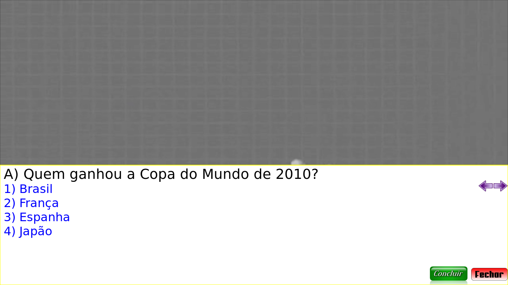

# TVD Quiz

> Aplicativo de quiz/trivia interativo para TV Digital, em NCL + Lua · Ueslei Taivan (Faculdade Católica do Tocantins) e Manoel Campos da Silva Filho (IFTO) · 2010



## O que é
Aplicação de TV Digital Interativa que exibe um vídeo em tela cheia e, sobreposta a ele, uma interface de quiz desenhada em Lua (NCLua). O `main.ncl` cuida do layout (regiões, descritores, conectores) e da reprodução do vídeo `Wanna_Work_Together_-_Creative_Commons.avi`, enquanto o `main.lua` desenha os botões e as alternativas via Canvas e controla a interação pelo controle remoto. As perguntas, alternativas e respostas corretas ficam num arquivo de dados local (`perguntas.lua`), carregado por um módulo de configuração próprio (`config.lua`) que usa `loadfile`/`setfenv`. O quiz é autocontido e funciona offline: não depende de canal de retorno nem de serviços externos.

## Como rodar
```bash
cd TVDQuiz
ginga main.ncl
```
Dica: adicione `-f` (tela cheia) ou `-s 960x540` (tamanho da janela).

## O que você deve ver
O vídeo em reprodução e, sobre ele, o painel de quiz desenhado em Lua. A verificação mostrou o quiz real na tela: a pergunta **"Quem ganhou a Copa do Mundo de 2010?"** com as alternativas numeradas **1) Brasil**, **2) França**, **3) Espanha**, **4) Japão** e os botões **Concluir** e **Fechar**, navegáveis pelo controle remoto. As demais perguntas (técnico da seleção, jogador cortado em 2010) estão embutidas em `perguntas.lua`.

## Status da verificação
Testado em **2026-06-24** · Ginga · Lua 5.3
- ✅ **Roda e funciona** — a interface do quiz aparece corretamente sobre o vídeo.
- Antes, o aplicativo abortava no carregamento com `./config.lua:16: attempt to call a nil value (global 'module')`: o Ginga atual embarca **Lua 5.3**, e a função global `module()` (usada por `config.lua`, escrito para Lua 5.1) foi removida no Lua 5.2+.
- Correção: foi adicionado um shim `compat.lua` que reativa `module()`/`setfenv()`, carregado por **uma única linha** `require "compat"` no topo de `main.lua`. Nenhuma outra alteração foi feita na lógica do app. Detalhes em [`docs/CODE-CHANGES.md`](../docs/CODE-CHANGES.md).

## Limitações conhecidas
- A correção depende do shim `compat.lua` (que usa a biblioteca `debug` para emular a troca de ambiente `_ENV` do Lua 5.1). Sem ele — ou em um Ginga que não exponha a biblioteca `debug` — o `config.lua` volta a quebrar no `module()`.
- O `config.lua` já registra que a função `save()` (módulo `io`) não funciona no Ginga — uso apenas para depuração.
- Aplicação offline/local: os dados das perguntas estão embutidos em `perguntas.lua`, sem dependência de rede.

## Arquivos principais
- `main.ncl` — documento NCL principal: regiões, descritores, conectores, links de teclas e reprodução do vídeo.
- `main.lua` — script NCLua principal: desenha a interface do quiz no Canvas e trata a interação do usuário. Inclui `require "compat"` na primeira linha.
- `compat.lua` — shim de compatibilidade Lua 5.1 → 5.3: reativa `module()`, `setfenv()`, `getfenv()` e `package.seeall`. Ver [`docs/CODE-CHANGES.md`](../docs/CODE-CHANGES.md).
- `perguntas.lua` — base de dados local das perguntas, alternativas e índice da resposta correta.
- `config.lua` — módulo utilitário para ler arquivos `.lua` como configuração (chama `module "config"` na linha 16).
- `media/` — vídeo `Wanna_Work_Together_-_Creative_Commons.avi` (Creative Commons) e imagens dos botões (PNG).
- `doc/` — documentação LuaDoc gerada dos scripts.
- `screenshots/TVDQuiz.png` — captura da execução verificada em 2026-06-24.
