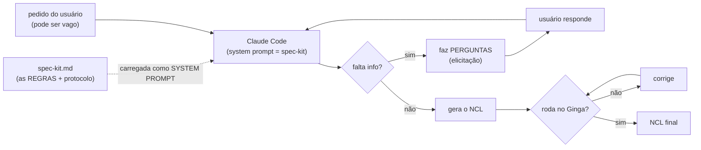

# Arquitetura — como a spec-kit vira *system prompt* (no Claude Code)

Este documento explica, passo a passo, **onde a spec fica** e **como ela é carregada** para que o modelo
a leia **sempre** — a parte que faltava documentar. É a diferença entre "colar as regras no prompt"
(simulação) e "a spec ser o *system prompt*" (o fluxo real do artigo).

## O fluxo (arquitetura)



O ponto-chave: a caixa **`spec-kit.md` → system prompt**. A spec **não** vai dentro da mensagem do
usuário; ela é o *system prompt*, então vale para **toda** a conversa, sem o usuário precisar repetir.

## Onde a spec fica

O arquivo [`spec-kit.md`](spec-kit.md) — o mesmo conteúdo do [`03-spec-kit-de-regras.md`](03-spec-kit-de-regras.md),
em formato enxuto pronto pra carregar. É a **fonte única** das regras + do protocolo de elicitação.

## As 3 formas de carregar como system prompt no Claude Code

| Forma | Comando / arquivo | Quando usar |
|---|---|---|
| **1. `--append-system-prompt-file`** | `claude --append-system-prompt-file spec-kit.md` (interativo) ou `claude -p "<pedido>" --append-system-prompt-file spec-kit.md` (headless) | Controle explícito; é o que o **benchmark usa** de verdade. É *literalmente* o system prompt. |
| **2. `CLAUDE.md`** | Colocar o conteúdo da spec num `CLAUDE.md` na raiz do projeto. O Claude Code **carrega automaticamente** em toda sessão daquele projeto. | Mais simples: "sempre carregada" sem passar flag. |
| **3. Agente customizado** | Definir `.claude/agents/gerador-ncl-spec.md` com a spec no corpo (o corpo do arquivo é o system prompt do agente). Usar com `claude --agent gerador-ncl-spec`. | Quando quer um "modo" nomeado, ou vários agentes. *(Obs: um agente novo só é reconhecido a partir de uma sessão nova.)* |
| **(4. SDK)** | Claude Agent SDK: opção `systemPrompt`/`appendSystemPrompt`. | Quando for construir o **produto/app** de verdade, fora do terminal. |

## Receita reproduzível (a que usamos no benchmark)

```bash
# a spec-kit.md é o SYSTEM PROMPT; o pedido do usuário é a mensagem
claude -p "<pedido do usuário>" \
  --append-system-prompt-file belo-ncl-spec-driven/spec-kit.md \
  --output-format text
```

- **T5 (regras):** 1 chamada — pedido detalhado + a spec como system prompt → NCL.
- **T6 (regras + elicitação):** o pedido é **vago**; a spec (system prompt) faz o modelo **perguntar**
  antes de gerar. Roda em 2 etapas: (1) pedido vago → **perguntas**; (2) pedido vago + respostas do
  usuário → **NCL**. As perguntas e respostas ficam salvas (`perguntas.md`, `respostas.md`).
- **T0/T1/T3** **não** usam a spec (são vago / zero-shot / few-shot), então rodam **sem** o
  `--append-system-prompt-file` — é isso que a comparação mede.

> **Nota de honestidade:** a *primeira* versão do benchmark colou o texto da spec **dentro do prompt**
> (simulação). A versão fidedigna (T5/T6) foi **re-executada** com a spec como *system prompt* de
> verdade, via `--append-system-prompt-file spec-kit.md` — ver
> [`benchmark/RESULTADO.md`](experimento-3-apps-com-botao/benchmark/RESULTADO.md).
