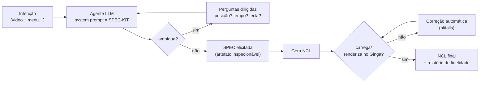

# Pesquisa — Autoria *Spec-Driven* de NCL com Agentes LLM

Esta pasta reúne a pesquisa por trás de um *position/WIP paper* (alvo: **WebMedia**) sobre
**autoria assistida de documentos NCL** para TV Digital brasileira (Ginga). A ideia central: em vez
de tratar a geração de código como *"prompt → caixa-preta → NCL"*, inserir uma **camada de
especificação elicitada** entre a **intenção** do autor e o **código** — a IA **pergunta o que falta**,
monta uma **spec** inspecionável e só então gera um `.ncl` **validado** no Ginga.

Aqui você encontra o **plano do artigo**, o **desenho do benchmark** que vai medir a hipótese, o
**spec-kit de regras** (o *system prompt* que instrumenta o agente), o **piloto `10menu`** e a
**replicação em 3 outros exemplos** — a evidência (n=4) de que estruturar a intenção reduz o
*gap semântico*.

---

## Resumo executivo — o fluxo e a hipótese

**O problema (gap semântico).** Existe uma distância entre a intenção do autor (*"um vídeo em cima, um
menu embaixo pra trocar a trilha, uma propaganda que aparece lá pelos 45 s"*) e a materialização disso
em NCL (regiões em %, descritores, `switch`, conectores causais, linha do tempo em segundos). A
abordagem ingênua entrega essa intenção **uma vez, vaga**, e o modelo **preenche as lacunas por conta
própria** — inventa posições, chuta tempos, escolhe teclas. Pior: o parser do Ginga é **estrito** —
um único atributo inválido **aborta o documento inteiro**.

**A hipótese central.** *Quanto mais **estruturada** for a descrição de intenção (ou **elicitada** por
perguntas) antes da geração, mais **fiel** — em layout, linha do tempo e interações — é o NCL gerado.*
Corolários: descrição vaga → roda, mas **reinventa** o app; descrição estruturada (uma *spec*) →
reproduz **linha do tempo e estrutura**; e uma etapa de **validação/correção** é **necessária** (os
modelos que tentam mais recursos são os que mais escorregam na sintaxe estrita do Ginga).

**O fluxo proposto** substitui a caixa-preta por um ciclo com dois laços — **elicitação** na frente e
**validação/correção** atrás — governado pelo **spec-kit**:



A **spec é elicitada por perguntas**, não escrita inteira de cara — é a diferença-chave frente à
caixa-preta. O detalhamento formal (hipóteses, contribuição, seções do paper, trabalhos relacionados)
está em [`01-plano-do-artigo.md`](01-plano-do-artigo.md).

---

## O resultado do piloto em 3 linhas

1. Um app NCL real (o menu do "Garrincha", `10menu`) foi recriado por uma IA **cega** (só via as mídias,
   sem o código original) a partir de 3 descrições de intenção: **B** (vaga), **C** (intermediária) e **A** (spec detalhada).
2. A fidelidade ao original **cresce de B → C → A**: **B** roda mas reinventa o app (layout com 3 janelas,
   propaganda aos 8 s em vez de 45 s, sem `switch`); **A** (a spec) reproduz a linha do tempo e a estrutura do original.
3. No teste "cru", **C e A não carregaram** por **1 atributo** de sintaxe (`transparency` como atributo do
   `<descriptor>`); corrigido esse ponto, ambos renderizaram — justamente o que a etapa de validação/correção existe para absorver.

Detalhes, tabela de fidelidade e figuras em [`experimento-1-piloto-10menu/RESULTADO.md`](experimento-1-piloto-10menu/RESULTADO.md).

---

## Índice

### Documentos

| Documento | O que é |
|---|---|
| [`01-plano-do-artigo.md`](01-plano-do-artigo.md) | O *blueprint* do artigo: título, motivação, hipóteses (H1–H3), o fluxo formalizado com diagrama, a evidência do piloto, estrutura de seções, agenda de pesquisa e trabalhos relacionados. |
| [`02-benchmark-de-prompting.md`](02-benchmark-de-prompting.md) | O desenho experimental: taxonomia de técnicas de *prompting*, matriz `técnica × app × modelo × rodada`, métricas (*Fidelity Score*, validade técnica, qualidade das perguntas), protocolo do agente cego, design mínimo e ameaças à validade. |
| [`03-spec-kit-de-regras.md`](03-spec-kit-de-regras.md) | O *system prompt* / spec-kit: regras estruturais, de mídia e de *pitfalls* do Ginga, o protocolo de elicitação por perguntas e o formato da spec intermediária (YAML). É o que o agente carrega antes de qualquer pedido. |

### Piloto `10menu`

| Item | O que é |
|---|---|
| [`experimento-1-piloto-10menu/RESULTADO.md`](experimento-1-piloto-10menu/RESULTADO.md) | O relato do experimento e a tabela de fidelidade (B/C/A vs. original), para quem chega sem contexto. |
| [`experimento-1-piloto-10menu/como-reproduzir.md`](experimento-1-piloto-10menu/como-reproduzir.md) | O passo a passo para reproduzir o piloto (montagem, 3 níveis de prompt, execução, comparação). |
| [`experimento-1-piloto-10menu/gabarito-10menu.ncl`](experimento-1-piloto-10menu/gabarito-10menu.ncl) | O **gabarito**: o app NCL real que a IA tenta recriar (fica **fora** da pasta de mídias de propósito). |
| [`experimento-1-piloto-10menu/prompts/`](experimento-1-piloto-10menu/prompts/) | Os 3 prompts de intenção: `nivel-B-vago.md` (B), `nivel-C-intermediario.md` (C), `nivel-A-spec.md` (A). |
| [`experimento-1-piloto-10menu/ncl-gerado/`](experimento-1-piloto-10menu/ncl-gerado/) | Os NCLs gerados pela IA: `nivel-B-vago.ncl`, `nivel-C-intermediario.ncl`, `nivel-A-spec.ncl` (este último **contém** o erro `transparency`, preservado como evidência). |
| [`experimento-1-piloto-10menu/figuras/`](experimento-1-piloto-10menu/figuras/) | Screenshots: `00-original.png`, `01-B-porco.png`, `02-C-intermediario.png`. |

### Replicação em 3 exemplos (n=4 no total)

| Item | O que é |
|---|---|
| [`experimento-2-replicacao/RESULTADO.md`](experimento-2-replicacao/RESULTADO.md) | Replicação **automatizada** do piloto em `02syncInt`, `07transition` e `08animation` (agentes cegos Opus, 3 níveis cada). Resultado: **9/9 carregam** no Ginga e o gradiente **B < C < A** se confirma em todos (nível A reproduz **~93–100%** da linha do tempo). |
| [`experimento-2-replicacao/ncl-gerado/`](experimento-2-replicacao/ncl-gerado/) | Os **9 NCLs** gerados pelos agentes cegos (`<exemplo>-B/C/A.ncl`). |
| [`experimento-2-replicacao/prompts/`](experimento-2-replicacao/prompts/) | Os 3 prompts (B/C/A) por exemplo, escritos pelo agente **analista**. |
| [`experimento-2-replicacao/figuras/`](experimento-2-replicacao/figuras/) | Execução no Ginga dos 9 gerados. |
| [`experimento-2-replicacao/gabaritos/`](experimento-2-replicacao/gabaritos/) | Os **gabaritos** dos 3 exemplos. |

### Artefatos de apoio (raiz do repositório)

| Caminho | O que é |
|---|---|
| [`../rfcs/`](../rfcs/) | RFCs técnicas dos exemplos NCL executáveis — os **gabaritos estruturados** que o benchmark usa (ex.: `0012-10-menu.md` para o `10menu`). |
| [`../docs/CODE-CHANGES.md`](../docs/CODE-CHANGES.md) | *Pitfalls* reais de execução do Ginga (Lua 5.1→5.3, `descriptorParam`, teclas no *headless*) — a fonte das regras do spec-kit. |

---

## Como reproduzir o experimento

O piloto foi rodado à mão; o [`como-reproduzir.md`](experimento-1-piloto-10menu/como-reproduzir.md) tem o passo a passo completo.
Em resumo:

1. **Isole as mídias.** Coloque **apenas** as 18 mídias do app (vídeos, imagens, áudios, formulários)
   numa pasta `sets/`. O NCL original (o gabarito) fica **fora** dessa pasta — o agente só pode ver as
   mídias, para o teste ser honesto (sem "colar").
2. **Abra o agente na pasta das mídias**, em um chat **novo/limpo** para cada nível (para um teste não
   contaminar o outro):
   ```bash
   cd .../sets
   claude
   ```
3. **Cole cada prompt** e salve a saída: `nivel-B-vago.md` → `app-B.ncl`; `nivel-C-intermediario.md`
   → `app-C.ncl`; `nivel-A-spec.md` → `app-A.ncl`. O agente gera o `.ncl` usando só as mídias que enxerga.
4. **Rode cada gerado no Ginga** (a partir de `sets/`):
   ```bash
   ginga app-A.ncl
   ```
5. **Compare com o gabarito** `gabarito-10menu.ncl`: layout (posições), linha do tempo (o que aparece
   quando), interações (teclas → efeitos), `switch` e mídias usadas. Diferenças **esperadas e OK**:
   caminhos de mídia (`animGar.mp4` vs. `../media/animGar.mp4`) e conectores *inline* vs. `importBase`
   — não contam como erro.

Para **generalizar** o piloto num benchmark reprodutível (harness, métricas automáticas, corpus de
apps, ablação de técnicas), o protocolo completo está em
[`02-benchmark-de-prompting.md`](02-benchmark-de-prompting.md).
