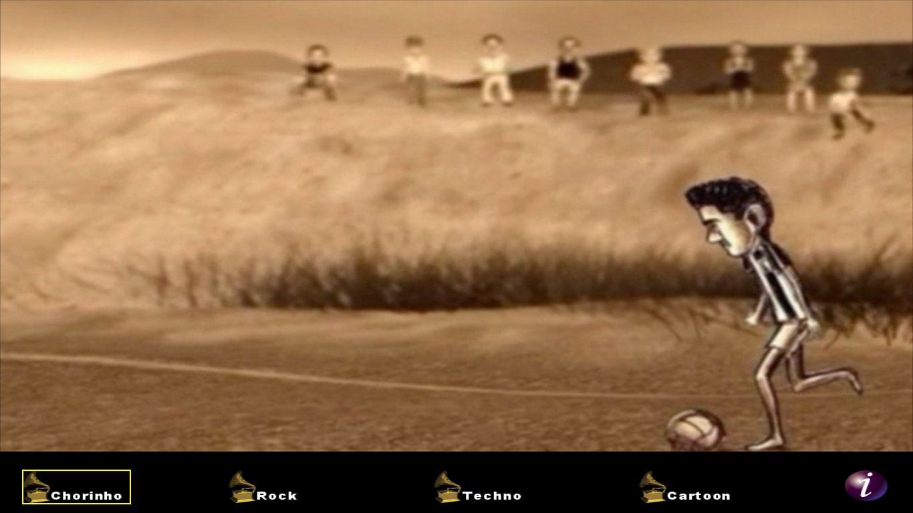
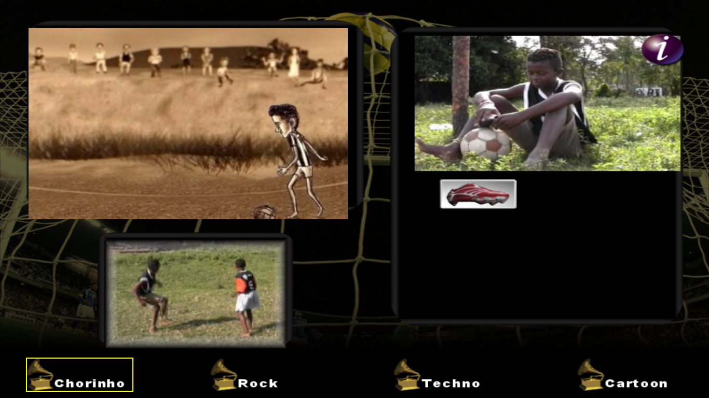
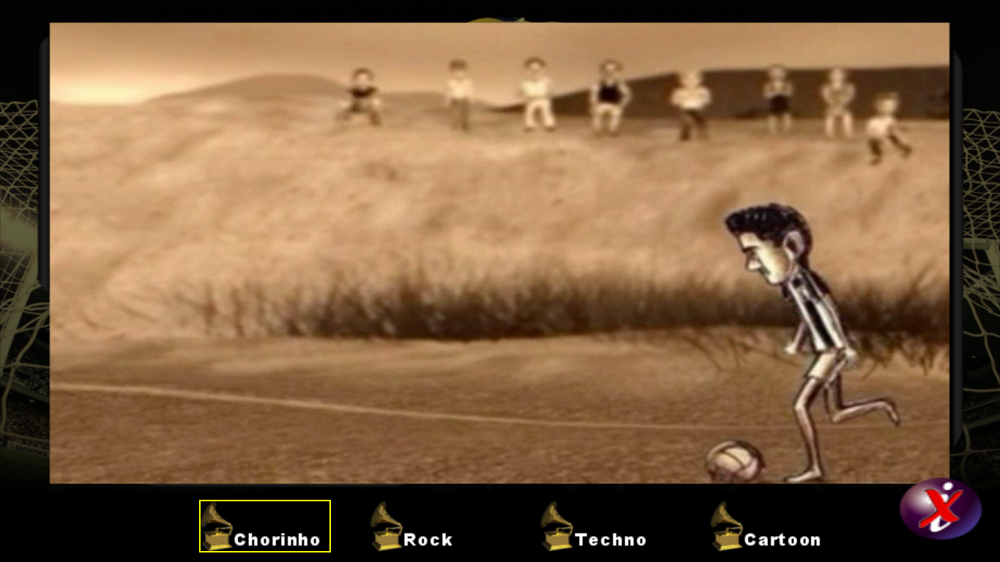

# Experimento: dá pra descrever a *intenção* de um app de TV e uma IA recriar o código?

*Um resumo pra quem está chegando agora, sem contexto nenhum.*

---

## 1. O contexto em 30 segundos

Na TV Digital brasileira, os aplicativos interativos (aqueles que rodam junto com um programa —
enquetes, menus, propagandas clicáveis) são escritos numa linguagem chamada **NCL**, executada por um
programa chamado **Ginga**. NCL é um XML que diz **o que** aparece, **onde** na tela, **quando** e
**como** o usuário interage.

Escrever NCL na mão é chato e técnico. A ideia da pesquisa é:

> **E se a pessoa só descrevesse a *intenção* ("um vídeo em cima, um menu embaixo pra trocar a
> música, uma propaganda que aparece no meio") e uma IA gerasse o código NCL?**

E, principalmente, a hipótese central:

> **Quanto mais organizada/estruturada for essa descrição de intenção, mais fiel fica o código que a
> IA gera.** (No paper isso vira uma "camada de especificação" entre a pessoa e o código.)

Este experimento é o **primeiro teste** dessa hipótese.

---

## 2. Como o teste foi montado

1. Peguei um app NCL **real** e já existente — um menu interativo do "Garrincha": um desenho tocando,
   um menu embaixo pra trocar a trilha sonora (Chorinho / Rock / Techno / Cartoon), overlays no canto e
   uma propaganda de tênis que abre um formulário.
2. Coloquei **só as mídias** desse app (vídeos, imagens, áudios) numa pasta isolada — **sem** o código
   original. Assim a IA que vai gerar o NCL **não tem como "colar"**; ela só vê os arquivos de mídia.
3. Descrevi a intenção do app em **3 níveis de detalhe** e pedi pra uma **IA "cega"** (que não conhecia
   o original) recriar o app a partir de cada descrição.
4. Rodei cada resultado no Ginga e comparei com o app original.

### Os 3 níveis de descrição

| Nível | Como é | Exemplo |
|-------|--------|---------|
| **B – "porco"** | Curto e vago, como qualquer um digitaria correndo. | *"um vídeo do garrincha tocando com música, um menu embaixo pra trocar a música, e uma propaganda de tênis que aparece."* |
| **C – intermediário** | Casual, mas com **noção de espaço e tempo** (cantos, base, "lá pelos 40s"). | *"...num quadradinho no canto superior esquerdo aparece uma foto lá pelos 40s..."* |
| **A – detalhado (a "spec")** | Estruturado: posições, tempos, durações e teclas precisas. | *"...região do menu no topo 91,7%, 4 botões; a propaganda aparece em 45s no canto superior direito..."* |

---

## 3. O que aconteceu

### O original (o "gabarito")
Vídeo grande no topo, menu com 4 botões embaixo, overlays em cantos específicos, propaganda que só
aparece por volta dos 45 segundos.

### Nível B (prompt "porco") — funcionou, mas **inventou outro app**
A IA rodou de primeira, mas **criou um layout totalmente diferente**: três "janelas" de vídeo, a
propaganda já aparecendo logo no começo (aos 8s em vez de 45s), e um arranjo que não é o do original.
Ou seja: **funciona, mas não reproduz o app.**

### Nível C / A (mais detalhe) — **muito mais fiéis** ao original
As descrições mais ricas fizeram a IA acertar o essencial: **vídeo grande no topo + menu de 4 botões
embaixo**, igual ao original. O nível A (a spec) foi ainda mais longe: reproduziu a **linha do tempo
inteira** (as coisas aparecendo em 5s, 12s, 41s, 45s, 51s, 64s — exatamente os mesmos momentos do
original) e usou as **18 mídias** e as **11 regiões** do original.

### A tabela que resume tudo

| Sinal de fidelidade | **Original** | **B (porco)** | **C (inter.)** | **A (spec)** |
|---|:---:|:---:|:---:|:---:|
| **Linha do tempo** (instantes que disparam algo) | 5s, 12s, 41s, 45s, 51s, 64s | só 8s (inventado) | implementou **sem âncoras temporais** | **5s, 12s, 41s, 45s, 51s, 64s** ✅ (timeline inteira) |
| **Seleção de conteúdo** (mecanismo `switch`) | 2 | 0 | 0 | **1** |
| **Mídias distintas usadas** (de 18) | 18 | 16 | 17 | **18** ✅ (todas) |
| **Regiões** | 11 | 11 | 14 | **11** ✅ (igual ao original) |
| **Layout** | (referência) | inventou layout de 3 janelas ❌ | vídeo + menu embaixo ✅ | vídeo + menu embaixo ✅ |
| **Carrega no Ginga** | — | sim | após corrigir 1 atributo | após corrigir 1 atributo |

**Leitura da tabela:** conforme a descrição fica mais estruturada (**B → C → A**), o resultado fica mais
parecido com o original. O A (a spec) foi o mais fiel de todos — reproduziu a linha do tempo completa,
usou as 18 mídias e as 11 regiões do original.

---

## 4. Um detalhe importante (que reforça a pesquisa)

No primeiro teste "cru", o **B carregou** e o **C/A não**. Parece contraditório, mas o motivo é
esclarecedor: os prompts detalhados (C e A) **tentaram** um recurso a mais (uma foto semitransparente,
que o B simplesmente ignorou) e escreveram **um atributo de NCL de um jeito que o Ginga não aceita**.
Bastou **corrigir esse 1 atributo** e os dois passaram a **carregar e renderizar normalmente** — o C
ficou bem parecido com o original.

Ou seja:
- O "erro" do C/A **não é da ideia** — é um deslize de sintaxe.
- E é **exatamente para isso** que a arquitetura proposta no paper tem uma **etapa de
  validação/correção automática**. O experimento mostrou que essa etapa é necessária **e** por quê.

---

## 5. Conclusão

- ✅ **A hipótese se sustentou:** descrição vaga → a IA reproduz o "grosso" mas **inventa** os detalhes e
  o layout; descrição estruturada (spec) → a IA reproduz a **linha do tempo e a estrutura** do original.
- ✅ O experimento também **justificou a etapa de validação/correção** do pipeline.
- ⚠️ **Ressalva honesta:** isto é **1 exemplo** (n=1). Serve perfeitamente como a "demonstração mínima"
  de um *position paper*, mas para virar número numa avaliação formal seria preciso repetir com vários
  apps e algumas rodadas cada.

**Em uma frase:** a diferença entre o app que a IA gerou a partir de um pedido vago e o que ela gerou a
partir de uma spec estruturada **é a evidência visível do "gap semântico"** que a pesquisa quer fechar.
