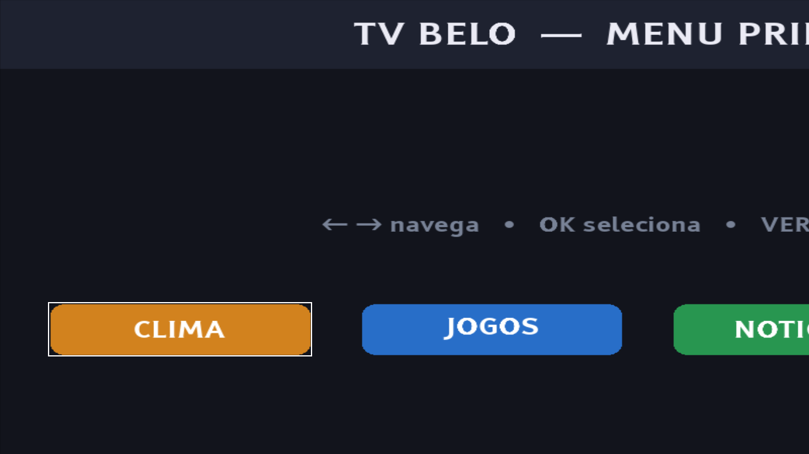
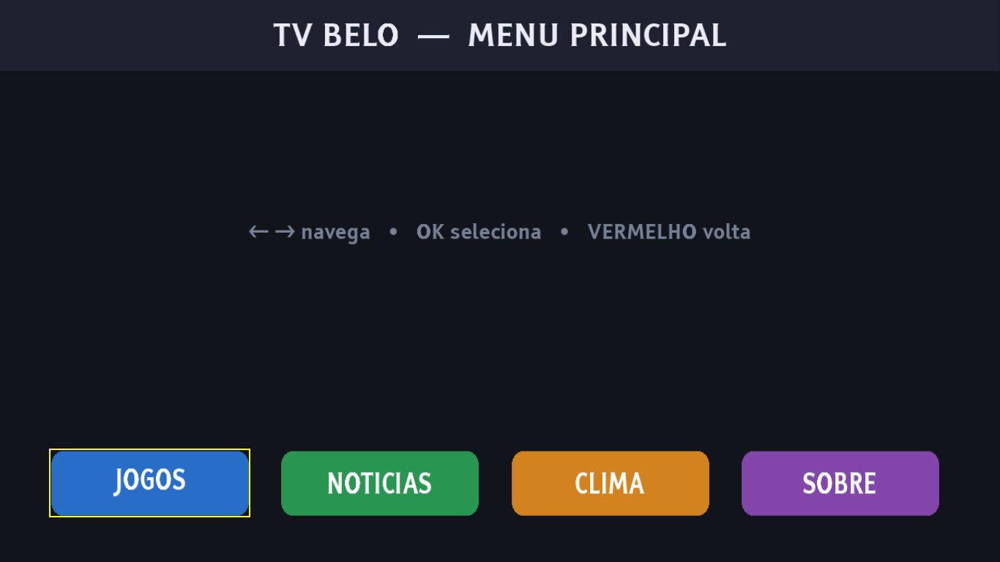

# Benchmark de técnicas de prompting — apps com botão + navegação

Este benchmark roda **5 técnicas de prompting** (T0, T1, T3, T5, T6) sobre os **4 apps de botão** do
[corpus](../README.md). Para cada célula (app × técnica), um **agente Opus cego** (só vê as imagens, não
o gabarito) gera o NCL; depois rodamos no Ginga e comparamos com o gabarito. **Tudo foi capturado**: o
prompt de entrada (`entrada.md`), a resposta da IA (`saida.md`), o NCL gerado (`gerado.ncl`), o
screenshot da execução (`tela-gerada.png`) e — no T6 — o **diálogo** (`perguntas.md` + `respostas.md`).

> As técnicas seguem a taxonomia de [`../../02-benchmark-de-prompting.md`](../../02-benchmark-de-prompting.md):
> **T0** vago · **T1** zero-shot estruturado · **T3** few-shot (com exemplo) · **T5** spec-kit de regras ·
> **T6** spec-kit + elicitação por perguntas (**o fluxo do paper**).

> ⚙️ **Mecanismo (fidedigno):** nas condições **T5 e T6**, a spec-kit é o **system prompt de verdade** —
> carregada com `claude -p "<pedido>" --append-system-prompt-file spec-kit.md`, **não** colada dentro da
> mensagem. É o fluxo real do Claude Code (ver [`../../04-arquitetura-system-prompt.md`](../../04-arquitetura-system-prompt.md)).
> T0/T1/T3 rodam **sem** a spec. Os 8 documentos de T5/T6 foram **re-executados** assim e **todos os 8
> carregam** no Ginga, com a estrutura (foco/ports/tecla) batendo com o gabarito.

## Resultado geral (4 apps × 5 técnicas = 20 células)

| Técnica | Carrega no Ginga | Fidelidade estrutural média* |
|---|:---:|:---:|
| **T0** — vago | 4/4 | 3.8 / 5 |
| **T1** — zero-shot | **3/4** | **3.2 / 5** |
| **T3** — few-shot | 4/4 | **5.0 / 5** |
| **T5** — regras | 4/4 | **5.0 / 5** |
| **T6** — elicitação | 4/4 | **4.8 / 5** |

\* *Fidelidade estrutural = quantos sinais de navegação (nº de botões focáveis, setas, tecla OK, tecla
VERMELHA, ports) batem com o gabarito. Métrica grosseira — complementada pelos screenshots e pela
análise qualitativa abaixo.*

**Leitura:** as técnicas **estruturadas (T3, T5, T6)** superam as **não-estruturadas (T0, T1)** —
tanto em carregar quanto em reproduzir a navegação certa.

## Achado 1 — "carrega" ≠ "está certo" (por isso os screenshots importam)

O **T0 (vago)** *carrega* nos 4 apps, mas o resultado sai **errado**. No `app-1-menu`, o T0 pôs os
botões **fora de ordem e em escala quebrada** (CLIMA primeiro, cortado); o **T5 (regras)** reproduziu
**fielmente** (ordem certa, foco em amarelo):

| T0 — vago (errado) | T5 — regras (fiel) |
|---|---|
|  |  |

> Só olhando a tela dá pra ver que o T0 está quebrado — o log dizia "carrega". Daí a importância de
> capturar o screenshot de **cada** geração.

## Achado 2 — a ELICITAÇÃO (T6) recupera a intenção que o prompt vago perde

No T6, a IA (com o spec-kit) **fez perguntas** antes de gerar. Uma delas foi a **ordem dos botões** — e
o "usuário" **corrigiu**:

> **IA perguntou:** *"1.1. Confirma os 4 botões (Clima, Jogos, Notícias, Sobre) nessa ordem da esquerda
> pra direita?"*
> **Usuário respondeu:** *"4 botões, mas a ordem certa é **JOGOS, NOTICIAS, CLIMA, SOBRE**. Não é Clima
> primeiro."*

É exatamente o detalhe que o **T0 errou** (gerou Clima primeiro). A elicitação **fez a pergunta certa** e
fechou o plano com a ordem correta. O diálogo completo está em
[`app-1-menu/T6-elicitacao/perguntas.md`](app-1-menu/T6-elicitacao/perguntas.md) e
[`respostas.md`](app-1-menu/T6-elicitacao/respostas.md) — a IA perguntou sobre posição do menu,
navegação (circular?), o que o OK faz, como voltar, título, transparência e áudio.

## Achado 3 — sem regras/exemplo, o modelo erra a SINTAXE

O único que **não carregou** foi o `app-2-guia` no **T1 (zero-shot)**: usou `key` como atributo do
`<bind>` (`Element <bind> at line 153: Unknown attribute 'key'`) — um erro de sintaxe do NCL. As técnicas
com **exemplo (T3)** ou **regras (T5/T6)** mostravam o jeito certo (a tecla vai no conector, não no
`<bind>`) e **não** cometeram esse erro. Reforça o valor do spec-kit e da etapa de validação/correção.

## Conclusão

- **Mais estrutura → mais fidelidade**, agora também em apps de **botão/navegação** (não só nos exemplos
  fáceis de sincronismo): T3/T5/T6 ≫ T0/T1.
- A **elicitação (T6)** — o fluxo do paper — não só gera bem como **recupera a intenção exata** via
  perguntas dirigidas (a ordem dos botões é o caso-exemplo).
- **Ressalvas honestas:** (1) a métrica estrutural é grosseira; a prova forte é o conjunto
  *carrega + screenshot + estrutura + o diálogo*; (2) algumas gerações renderizam em **escala diferente**
  (variação de layout); (3) é **1 rodada** por célula e **4 apps** — para virar número no artigo, repetir
  com mais rodadas e apps. O T3 (few-shot) foi cortado do foco do paper (já explorado no trabalho
  anterior), mas entra aqui como **baseline comparativo forte**.

---
*Artefatos por célula em `<app>/<técnica>/`: `entrada.md` (prompt), `saida.md` (resposta da IA),
`gerado.ncl` (NCL), `tela-gerada.png` (execução no Ginga); no T6, `perguntas.md` + `respostas.md`.*
