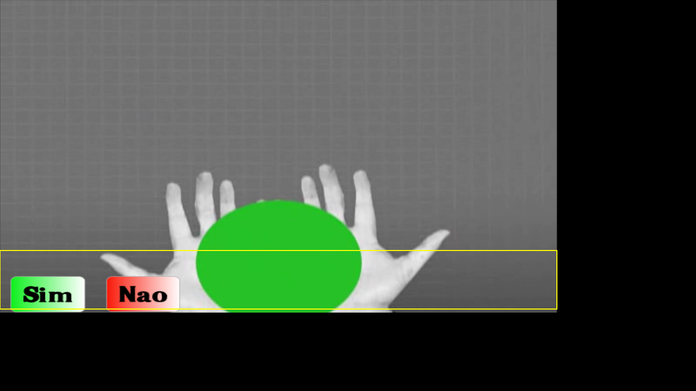

# Enquete NCL

> Sistema de enquete/votação ("Sim/Não") para TV Digital usando NCL + Lua e canal de retorno · Manoel Campos da Silva Filho (manoelcampos.com) · 2009-2010

## O que é
Aplicação de TV Digital Interativa que exibe um vídeo e dois botões ("Sim" / "Não") sobre ele. O telespectador vota pressionando a tecla verde (Sim) ou vermelha (Não) do controle remoto. O documento NCL (`main.ncl`) cuida da apresentação e das interações; ao registrar o voto, um script NCLua (`votacao.lua`) usa a biblioteca `tcp.lua` (co-rotinas Lua para simular conexões TCP não-bloqueantes) para enviar o voto a uma página PHP remota (`votacao2.php`). O PHP gravava os votos em arquivos texto e devolvia uma tabela Lua com o resultado (`votos = { sim, nao, url }`), que era executada e exibida na tela. Desenvolvido por Manoel Campos da Silva Filho, então mestrando em Engenharia Elétrica (TV Digital) na UnB.

## Como rodar
```bash
cd enquete-ncl
ginga main.ncl
```
Dica: adicione `-f` (tela cheia) ou `-s 960x540` (tamanho da janela).

## O que você deve ver
O vídeo de fundo (*Wanna Work Together*, Creative Commons) com os botões **"Sim"** e **"Nao"** sobre ele, no canto inferior esquerdo. A interface de votação aparece e responde normalmente.



## Status da verificação
Testado em **2026-06-24** · Ginga · Lua 5.3

- ✅ **Roda.** A UI de votação aparece: os botões "Sim" e "Nao" são exibidos sobre o vídeo de fundo (ver screenshot acima).
- **Antes** a aplicação crashava no carregamento, em `tcp.lua:14`, com o erro `attempt to call a nil value (global 'module')` — a função global `module()` do Lua 5.1 foi removida no Lua 5.2+, e o Ginga atual embarca Lua 5.3.
- **Correção:** foi adicionado o shim `compat.lua` (que reativa `module()`/`setfenv()`) e incluída **1 linha** — `require "compat"` — no topo de `votacao.lua`. Nenhuma outra linha da lógica original foi tocada. Detalhes em `docs/CODE-CHANGES.md`.
- **Ressalva honesta:** a interface aparece e funciona, mas **votar de fato não se completa**. O envio do voto dependia do backend PHP `votacao2.php`, hospedado em servidor remoto (originalmente em manoelcampos.com), que não existe mais. Sem ele, não há resposta para exibir o resultado.

## Limitações conhecidas
- **Envio do voto não completa**: a confirmação e o resultado dependem de `votacao2.php` em servidor remoto, hoje indisponível. A UI funciona, mas o voto não chega a ser contabilizado nem o resultado é retornado.
- **Canal de retorno**: a aplicação assume conectividade TCP/HTTP a partir do receptor (canal de retorno da TVD), recurso que, somado à ausência do backend, impede o fluxo completo de votação.
- **Compatibilidade Lua**: o código original é Lua 5.1 e só roda no Ginga atual (Lua 5.3) graças ao shim `compat.lua`. Sem ele, o app aborta no carregamento (ver `docs/CODE-CHANGES.md`).

## Arquivos principais
- `main.ncl` — documento NCL principal (regiões, descritores, conectores e links da votação Sim/Não).
- `votacao.lua` — script NCLua que envia o voto e exibe o resultado retornado pelo servidor; recebeu `require "compat"` na linha 1 (única alteração na lógica original).
- `compat.lua` — shim **novo** que reativa `module()`, `setfenv()`, `getfenv()` e `package.seeall` (removidos no Lua 5.2+), permitindo que os scripts Lua 5.1 carreguem no Lua 5.3 do Ginga.
- `tcp.lua` — biblioteca de conexões TCP via co-rotinas Lua (origem: tutorial NCLua da PUC-Rio/TeleMídia); usava `module 'tcp'` (linha 14), que era a fonte do crash antes do `compat.lua`.
- `votacao2.php` — backend PHP que registrava os votos em arquivos texto e gerava a tabela Lua de resultado; servidor remoto hoje indisponível.
- `media/` — `Wanna_Work_Together_-_Creative_Commons.avi` (vídeo) e `sim.png` / `nao.png` (botões).
- `vera.ttf` — fonte usada para desenhar texto no canvas.
- `LEIAME.txt` — nota com o link do artigo original do autor.
- `doc/` — documentação LuaDoc gerada dos scripts.
- `screenshots/enquete.png` — captura da verificação de 2026-06-24 (UI de votação rodando).
- `Screenshot-Sistema-Enquete-TVD-Ginga-NCL.png` — captura de tela histórica (2010) do app original.
