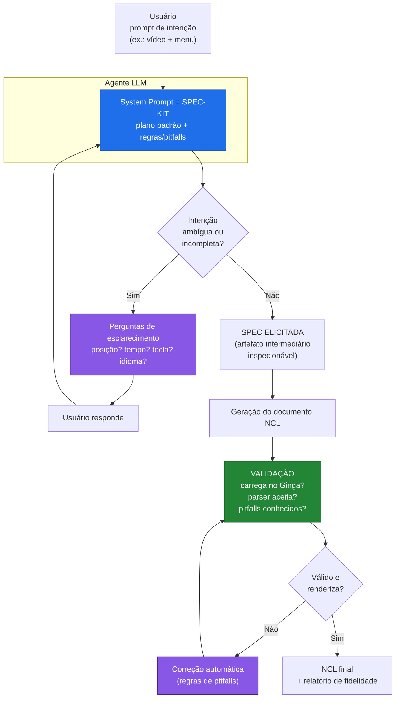

# Plano do Artigo — Autoria Spec-Driven de Documentos NCL com Agentes LLM

> **Tipo:** *position / work-in-progress paper*
> **Veículo-alvo:** WebMedia (Simpósio Brasileiro de Sistemas Multimídia e Web)
> **Grupo:** Paulo Victor Borges, Daniel de S. Moraes, Simone D. J. Barbosa, Sergio Colcher (+ autoria discente)
> **Status:** rascunho de plano — consolida a ideia central (fluxo refinado aprovado) e a evidência inicial (piloto `10menu`).

Este documento **não é o artigo**; é o *blueprint* dele. Define título, enquadramento, motivação, hipótese, contribuição, o fluxo formalizado (com diagrama), a evidência do piloto, a estrutura de seções, a agenda de pesquisa e a conexão com trabalhos relacionados. O objetivo é que qualquer coautor consiga escrever cada seção a partir daqui.

---

## 1. Título(s) sugerido(s) e enquadramento

**Título principal (recomendado):**
> **Da Intenção ao Ginga: Autoria Spec-Driven de Documentos NCL com Agentes LLM e Elicitação por Perguntas**

**Alternativas:**
- *Fechando o Gap Semântico na Autoria de TV Digital: uma Camada de Especificação entre a Intenção e o Código NCL*
- *Toward Spec-Driven Authoring of NCL Documents with LLM Agents* (título de trabalho já registrado internamente; serve como versão curta/EN)
- *"Não é uma Caixa Preta": Elicitação Dirigida de Especificações para Geração de NCL Assistida por LLM*

**Enquadramento.** É um **position/WIP paper**: a contribuição principal é **conceitual e arquitetural** (um fluxo e uma hipótese), sustentada por uma **demonstração mínima** (o piloto `10menu`, n=1) e por uma **agenda de avaliação** proposta, não por um *benchmark* fechado. Esse formato é adequado ao WebMedia como veículo de discussão de agenda de pesquisa da comunidade de sistemas multimídia e TV Digital brasileira, onde NCL/Ginga são objetos nativos. A honestidade sobre o n=1 é parte do argumento: o piloto existe para tornar o *gap semântico* **visível e mensurável**, não para provar generalidade.

---

## 2. Motivação — o gap semântico e o problema da "caixa preta"

**O domínio.** Na TV Digital brasileira, aplicações interativas (enquetes, menus, propagandas clicáveis, *overlays* sincronizados a um programa) são escritas em **NCL** (Nested Context Language), um XML declarativo executado pelo *middleware* **Ginga**. NCL descreve **o quê** aparece, **onde** na tela (regiões), **quando** (relações temporais/causais) e **como** o usuário interage (teclas → efeitos, via conectores e elos). Escrever NCL à mão é técnico e verboso, e o parser do Ginga é **estrito**: um único atributo inválido aborta o carregamento inteiro do documento.

**O gap semântico.** Existe uma distância entre a **intenção do autor** ("um vídeo em cima, um menu embaixo para trocar a trilha, uma propaganda que aparece por volta dos 45 s e abre um formulário") e a **materialização dessa intenção em código NCL** (regiões em porcentagens exatas, descritores, *switches*, conectores causais, linha do tempo em segundos). Esse é o *gap semântico* que a pesquisa quer fechar.

**O problema da caixa preta.** A abordagem ingênua — **prompt → LLM → NCL** — trata o LLM como uma **caixa preta**: o autor descreve a intenção *uma vez*, de forma tipicamente vaga, e recebe de volta um documento cujo comportamento ele não controlou. Quando a descrição é incompleta (e quase sempre é), o modelo **preenche as lacunas por conta própria** — inventa posições, chuta tempos, escolhe teclas — e o autor só descobre a divergência ao rodar. Não há **negociação** da intenção; não há um artefato intermediário inspecionável; não há garantia de que o resultado sequer **carrega** no Ginga. O gap semântico não é fechado — é apenas empurrado para depois da geração, onde vira frustração de depuração.

> **A tese em uma frase:** substituir a caixa preta (*prompt → NCL*) por uma **camada de especificação elicitada** (*intenção → perguntas → spec → NCL validado*), na qual a estrutura da intenção é **construída em diálogo** antes de gerar código.

---

## 3. Hipótese e contribuição

### 3.1 Hipótese central

> **H1 — Estrutura reduz o gap.** Quanto mais **estruturada** for a descrição de intenção fornecida (ou *elicitada*) antes da geração, mais **fiel** ao comportamento pretendido é o documento NCL gerado — em layout, linha do tempo e mecanismos de interação.

Corolários testáveis:
- **H1a:** descrições vagas produzem código que *roda* mas *reinventa* detalhes e layout (baixa fidelidade estrutural).
- **H1b:** descrições estruturadas (uma *spec*) produzem código que reproduz a **linha do tempo** e a **estrutura** (regiões, *switches*) do comportamento pretendido.
- **H2 — Elicitação ≈ escrever a spec.** Uma spec **elicitada por perguntas dirigidas** aproxima-se, em fidelidade, de uma spec escrita manualmente pelo autor — a um custo de esforço muito menor para o autor leigo.
- **H3 — Validação é necessária.** Uma etapa de **validação/correção** automática pós-geração é necessária: modelos que *tentam mais* (recursos avançados como transparência) são os que mais escorregam em pontos sintáticos que o parser estrito do Ginga rejeita.

### 3.2 Contribuição

A contribuição do paper é um **fluxo de autoria** e três artefatos que o instanciam:

1. **Spec-kit de regras (o *system prompt* spec-driven).** Um conjunto curado de regras que o agente **sempre** aplica: (a) um **plano/estruturação padrão** de um documento NCL (o esqueleto que toda intenção deve preencher — regiões, descritores, mídias, linha do tempo, interações); e (b) um catálogo de **pitfalls conhecidos** do Ginga/NCL derivados de experiência real de execução (ver §6). O spec-kit é o que transforma "gerar NCL" em "gerar NCL **segundo uma especificação**".

2. **Elicitação por perguntas (a spec construída em diálogo).** Em vez de exigir que o autor escreva a spec inteira de cara, o agente **detecta ambiguidade** e **devolve perguntas de esclarecimento** ("em que segundo a imagem aparece?", "em qual canto?", "qual tecla ativa a propaganda?", "qual o idioma padrão do formulário?"). A spec é **elicitada incrementalmente**. Esta é a diferença-chave em relação à caixa preta.

3. **Benchmark de técnicas de prompting + validação estrutural.** Um protocolo de avaliação que compara técnicas de *prompting* (baseline vago, zero-/one-/few-shot, e *rules-augmented* com o spec-kit) sob **métricas de fidelidade** objetivas: (i) **carrega/renderiza no Ginga?** e (ii) **comparação estrutural com um gabarito** (linha do tempo, nº de regiões, nº de *switches*, mídias usadas, layout). O piloto `10menu` é a primeira instância desse benchmark.

---

## 4. O fluxo refinado (formalização)

O fluxo aprovado substitui *prompt → caixa preta → NCL* por um ciclo com **elicitação** (frente) e **validação/correção** (trás), com o **spec-kit** governando ambos.

**Passos:**
1. O usuário escreve um **prompt de intenção** (ex.: *"quero uma aplicação NCL com um vídeo e um menu"*).
2. O prompt chega a um **agente LLM cujo *system prompt* é o spec-kit** — o plano de estruturação padrão + as regras/pitfalls que o agente **sempre** aplica.
3. Seguindo o spec-kit, se a intenção estiver **ambígua ou incompleta**, o agente **não gera código**: ele **retorna perguntas de esclarecimento** dirigidas às lacunas do esqueleto da spec (posição, tempo, duração, tecla, idioma…).
4. O usuário **responde**; as respostas refinam a **spec elicitada**. O ciclo (3–4) repete até a spec estar completa o suficiente.
5. O agente **gera o documento NCL** a partir da spec elicitada e o submete à **validação**: carrega no Ginga? o parser aceita? viola algum pitfall conhecido? Se falhar, uma etapa de **correção automática** (guiada pelas regras de pitfalls) reescreve e revalida. Ao passar, devolve o **NCL final** — e, opcionalmente, um **relatório de fidelidade** contra a spec.

**Invariante central:** a **spec é elicitada por perguntas**, não escrita inteira de cara pelo autor. É um artefato **intermediário e inspecionável** — o oposto da caixa preta.

**Dois laços fecham o gap:**
- **Laço da frente (elicitação, passos 3–4):** fecha o gap *antes* de gerar, negociando a intenção. Testa **H2**.
- **Laço de trás (validação/correção, passo 5):** garante que o que foi gerado **executa**, absorvendo os pitfalls do parser estrito. Testa **H3**.

---

## 5. Evidência inicial — o piloto `10menu`

Para tornar o gap semântico **visível e mensurável**, conduzimos um piloto (arquivos em `research/piloto-10menu/`).

**Montagem.** Tomamos um app NCL **real** — o menu interativo do "Garrincha" (`original-10menu.ncl`): vídeo em tela quase cheia, **menu de 4 trilhas** na base (Chorinho/Rock/Techno/Cartoon), *overlays* temporizados em cantos (clipe de drible, foto), indicador de interatividade e uma **propaganda** que abre um formulário HTML. Isolamos **apenas as mídias** numa pasta, **sem o código original**, e pedimos a um **LLM "cego"** (sem acesso ao gabarito) que recriasse o NCL a partir de descrições de intenção em **três níveis de estrutura**:

| Nível | Descrição | Caráter |
|---|---|---|
| **B — "porco"** | curta e vaga, como qualquer um digitaria correndo | *baseline* (`prompts/PROMPT-simples.md`) |
| **C — intermediário** | casual, mas com **noção de espaço e tempo** (cantos, base, "lá pelos 40 s") | meio-termo (`prompts/PROMPT-intermediario.md`) |
| **A — spec detalhada** | estruturada: **posições, tempos, durações e teclas** precisas | a *spec* (`prompts/PROMPT-detalhado.md`) |

Cada saída foi **executada no Ginga** e **comparada estruturalmente** com o gabarito.

### 5.1 Achado principal — a fidelidade cresce B → C → A

| Sinal de fidelidade | **Original** | **B (porco)** | **C (inter.)** | **A (spec)** |
|---|:---:|:---:|:---:|:---:|
| **Linha do tempo** (instantes que disparam algo) | 5 s, 12 s, 41 s, 45 s, 51 s, 64 s | só 8 s (inventado) | implementou **sem âncoras temporais** | **5 s, 12 s, 41 s, 45 s, 51 s, 64 s** ✅ (timeline inteira) |
| **Seleção de conteúdo** (mecanismo `switch`) | 2 | **0** | **0** | **1** |
| **Mídias distintas usadas** (de 18) | 18 | 16 | 17 | **18** ✅ (todas) |
| **Regiões** | 11 | 11 | 14 | **11** ✅ (igual ao original) |
| **Layout** | (referência) | inventou **layout de 3 janelas** ❌ | vídeo + menu embaixo ✅ | vídeo + menu embaixo ✅ |
| **Carrega no Ginga** | — | sim | após corrigir 1 atributo | após corrigir 1 atributo |

**Leitura.** Conforme a intenção fica mais estruturada (**B → C → A**), o resultado se aproxima do original. O nível **B** *roda*, mas **reinventa o app**: layout com 3 janelas, propaganda aos **8 s** (em vez de 45 s), **0 switches**, 16 mídias, 11 regiões. O nível **A** (a spec) foi **ainda mais fiel**: reproduz a **linha do tempo inteira** (5 s, 12 s, 41 s, 45 s, 51 s, 64 s), usa as **18 mídias** e as **11 regiões** do original, e a mesma estrutura de seleção (o original tem **2 switches**; a spec reproduziu **1**). É a confirmação visível de **H1/H1a/H1b**: descrição vaga → acerta o grosso e inventa os detalhes; spec estruturada → reproduz linha do tempo e estrutura.

### 5.2 Achado secundário — por que a validação é necessária (H3)

Na primeira execução "crua", **B carregou** e **C/A não**. O motivo reforça a arquitetura: os prompts detalhados (C e A) **tentaram um recurso a mais** — uma **foto semitransparente** que o B simplesmente ignorou — e escreveram o atributo de um jeito que o parser do Ginga **recusa** (`transparency` como atributo de `<descriptor>`, em vez de `<descriptorParam>`). **Removido/corrigido esse 1 atributo**, ambos passaram a **carregar e renderizar**. Ou seja: o "erro" de C/A **não é da ideia**, é um deslize de sintaxe — exatamente o que a **etapa de validação/correção** do fluxo (§4, laço de trás) existe para absorver. O piloto mostrou que essa etapa é necessária **e por quê**.

> **Ressalva honesta (a manter no paper):** é **n=1**. Serve como demonstração mínima de um *position paper*; para virar número em avaliação formal, é preciso repetir com vários apps e várias rodadas (ver agenda, §8).

---

## 6. Insumo para o spec-kit — pitfalls reais do Ginga/NCL

Regras candidatas ao *system prompt*, derivadas de execução real (ver também `docs/CODE-CHANGES.md`). Cada uma é uma regra de "sempre/nunca" ou um reparo automático:

- **Transparência:** usar `<descriptorParam name="transparency" value="0.6"/>` **dentro** do descritor; **nunca** `transparency=` como atributo do `<descriptor>`.
- **`<descriptorParam>`:** aceita **apenas** `name` e `value` (nada de `region`).
- **Áudio:** descritor **sem `region`** toca só o som (mesmo em `.mp4`).
- **Perfil:** EDTV, NCL 3.0, `xmlns="http://www.ncl.org.br/NCL3.0/EDTVProfile"`.
- **Conectores causais** podem ser **inline** (não é preciso importar base externa); cada `<link>` liga uma condição → uma ação.
- **NCLua (Lua):** o Ginga atual usa **Lua 5.3** — `module()`/`setfenv()` foram removidos (eram Lua 5.1); `string.format("%d", x)` exige inteiro (divisão gera *float* e quebra → usar `math.floor`).
- **Parser estrito:** um único atributo inválido **aborta o carregamento inteiro** — daí a necessidade de validação.

Esses pitfalls são simultaneamente (a) **regras de geração** (o agente evita o erro) e (b) **regras de correção** (o validador detecta e conserta).

---

## 7. O que validar / benchmarkar (desenho experimental proposto)

Aqui está a proposta concreta para a pergunta do grupo — **quais técnicas e quais regras** levar ao *benchmark*.

### 7.1 Técnicas de *prompting* a comparar (fatores)

| # | Condição | O que testa |
|---|---|---|
| T0 | **Baseline vago** ("porco", sem regras; estilo prompt B) | piso de fidelidade / a caixa preta |
| T1 | **Zero-shot estruturado** (instrução clara, **sem** exemplos, **sem** spec-kit) | efeito da estrutura da intenção sozinha (H1) |
| T2 | **One-shot** (1 exemplo prompt→NCL) | efeito de um exemplo |
| T3 | **Few-shot** (k exemplos NCL variados) | efeito de vários exemplos |
| T4 | **Chain-of-thought** / raciocínio explícito | efeito de planejar antes de gerar |
| T5 | **Spec-kit de regras** (rule-augmented no *system prompt*), **SEM** elicitação | efeito do spec-kit isolado |
| T6 | **Spec-kit + elicitação por perguntas** (o fluxo do paper, §4) | a contribuição-fim (H2 + H3) |
| T7 | **Few-shot + spec-kit + elicitação** (combinação) | se os exemplos somam sobre regras+perguntas |
| T8 | **Self-consistency** (N gerações + seleção/votação) | se a votação estabiliza a fidelidade |

Recomendação de escopo para o WIP: priorizar **T0, T1, T5, T6** (o eixo que sustenta a tese, com **T6** = o fluxo do paper) e tratar exemplos e CoT (**T2, T3, T4**) e a self-consistency (**T8**) como fatores secundários — evita explosão combinatória num paper de agenda.

### 7.2 Regras do spec-kit a ativar (ablação)

Para não benchmarkar "o spec-kit inteiro vs. nada", propõe-se uma **ablação** por camada, isolando o que cada parte contribui:

1. **R1 — Plano/esqueleto padrão** (força regiões+descritores+linha do tempo+interações explícitas).
2. **R2 — Catálogo de pitfalls** (as 7 regras de §6).
3. **R3 — Gatilho de elicitação** (detectar ambiguidade → perguntar em vez de chutar).
4. **R4 — Validação/correção** (rodar no Ginga + reparo automático).

Configurações mínimas sugeridas: `R1`, `R1+R2`, `R1+R2+R3`, `R1+R2+R3+R4` (= fluxo completo). Isso responde "qual regra puxa mais fidelidade".

### 7.3 Métricas de fidelidade (variáveis-resposta)

Duas ferramentas **já disponíveis**, que no piloto viraram a tabela de fidelidade:

1. **Executabilidade (Ginga):** binária/ordinal — **carrega?** **renderiza?** (e, ideal, sem erro de parser).
2. **Fidelidade estrutural vs. gabarito:**
   - **Linha do tempo** — desvio dos instantes-chave (ex.: {5,12,41,45,51,64} s) vs. gerado.
   - **Nº de regiões** e **layout** (bater as posições/estrutura, não pixel a pixel).
   - **Nº de `switch`** (mecanismo de seleção de conteúdo).
   - **Mídias usadas** (cobertura do conjunto de 18) e mídias corretas nos lugares certos.
   - **Interações** (teclas → efeitos: 4 trilhas via foco + **ENTER/OK**, INFO liga/desliga, RED abre propaganda).

Propõe-se consolidar num **escore de fidelidade** (média ponderada normalizada) por condição, além de reportar as dimensões cruas. Reportar também **nº de rodadas de elicitação** (custo de T5) e **taxa de correção automática** (frequência de pitfalls).

### 7.4 Protocolo

Repetir o desenho `10menu` para **um pequeno corpus** de apps NCL reais: o **núcleo** (`10menu`, `02syncInt`, `07transition`, `08animation`) mais os apps **maiores** (`A_Onda`, `TVDQuiz`, `enquete-ncl`, `rss-reader`) — o `damasTV` entra só como fonte de pitfalls. **k rodadas** por célula (mitiga variância do LLM), LLM **cego** ao gabarito, **chats limpos** entre condições, e **≥2 modelos** para checar robustez. Reportar média e dispersão.

---

## 8. Estrutura do paper (seções, 1 linha cada) e agenda

### 8.1 Seções

1. **Introdução** — o gap semântico na autoria de NCL e por que *prompt → caixa preta → NCL* não o fecha.
2. **Contexto: NCL/Ginga** — o essencial de NCL (regiões, descritores, *switch*, conectores/elos) e o parser estrito.
3. **Trabalhos relacionados** — LLMs na autoria de apps de TV (grupo), spec-driven/BDD-TDD, e *intent alignment* em geração de código (§9).
4. **O fluxo spec-driven proposto** — elicitação por perguntas + spec-kit + validação/correção; o diagrama e os dois laços (§4).
5. **O spec-kit** — plano/esqueleto padrão e catálogo de pitfalls reais do Ginga (§6).
6. **Piloto `10menu`** — desenho (3 níveis B/C/A), a tabela de fidelidade e os dois achados (§5).
7. **Discussão** — o que o piloto sustenta (H1) e justifica (H3), limites do n=1, ameaças à validade.
8. **Agenda / benchmark proposto** — técnicas, ablação de regras e métricas de fidelidade (§7).
9. **Conclusão** — a camada de especificação elicitada como caminho para fechar o gap semântico.

### 8.2 Agenda de pesquisa / trabalhos futuros

- **Do n=1 ao benchmark:** executar o protocolo de §7 sobre o corpus, com k rodadas e ≥2 modelos.
- **Formalizar o spec-kit** como artefato versionado e testável (uma "spec da spec"): esquema do esqueleto + regras de pitfall como *lint rules* verificáveis.
- **Elicitação inteligente:** estratégias de *quando parar de perguntar* (custo vs. ganho de fidelidade), ordenação de perguntas por impacto, e detecção automática de ambiguidade.
- **Validação/correção como *tool*:** acoplar o Ginga (carrega/renderiza) e um comparador estrutural como ferramentas do agente (loop de auto-reparo).
- **Fidelidade além da estrutura:** métricas de comportamento observável (execução dirigida por teclas, comparação de *frames*/renderização).
- **Estudo com usuários:** autores reais (não-programadores) usando o fluxo de elicitação vs. escrever a spec vs. a caixa preta — mede o custo de esforço de **H2**.
- **Generalização:** o método (spec-kit + elicitação + validação) além de NCL — outras DSLs declarativas de multimídia com parsers estritos.

---

## 9. Conexão com trabalhos relacionados

Quatro frentes ancoram o paper na literatura:

**(a) O trabalho anterior do próprio grupo (linha direta).**
- *"Enhancing TV Apps Authoring with LLM Agents"* — **IEEE Transactions on Broadcasting** (Borges, Moraes, Barbosa, Colcher). Estabelece o uso de **agentes LLM** na autoria de apps de TV Digital; este paper **avança** ao introduzir a **camada de especificação elicitada** entre intenção e código (o fluxo com perguntas + validação), em vez de tratar a geração como um passo único.
- **WebMedia 2023/2024** (contribuições do grupo) — situa a agenda de autoria assistida no veículo-alvo; usar para posicionar continuidade e comunidade.

**(b) Spec-driven / BDD / TDD como analogia metodológica.**
- **Spec-driven development** e *executable specifications* — a spec como artefato de primeira classe que guia (e verifica) a construção.
- **BDD (Behavior-Driven Development)** e **TDD (Test-Driven Development)** — a ideia de **especificar o comportamento antes de implementar** e ter um oráculo que valida. Analogia central: a **spec elicitada** faz o papel do *behavior spec*/teste, e a **validação no Ginga** faz o papel da *suíte de testes* (o app "passa" se carrega, renderiza e bate a fidelidade estrutural). O laço de correção automática é análogo ao *red-green-refactor*.

**(c) *Intent alignment* em geração de código por LLM.**
- Literatura de **program synthesis / NL-to-code** e o problema de **alinhamento de intenção** (a especificação em linguagem natural é ambígua e subespecificada). Conectar com trabalhos de **elicitação de requisitos assistida por LLM** e de **especificações interativas** (o modelo pergunta antes de gerar) como precedente para o **laço de elicitação**.
- **Self-repair / self-debugging** em geração de código (o modelo executa, observa o erro e corrige) — precedente direto para o **laço de validação/correção** contra o parser estrito do Ginga.
- *Benchmarks* de geração de código (estilo *pass@k*/execução funcional) — inspiram as **métricas de executabilidade e fidelidade** de §7, adaptadas ao domínio NCL (carrega no Ginga + comparação estrutural com gabarito).

**Posicionamento em uma frase:** o paper transporta a intuição de **spec-driven/BDD** e de **self-repair** da engenharia de software para a **autoria declarativa de multimídia (NCL/Ginga)**, e mostra — com o piloto — que **estruturar/elicitar a intenção** é o que fecha o gap semântico que a abordagem de caixa preta deixa aberto.

---

*Arquivos de apoio:* piloto em `research/piloto-10menu/` (`RESULTADO.md`, `INSTRUCOES.md`, `prompts/`, `gerados/`, `figuras/`); pitfalls de execução em `docs/CODE-CHANGES.md`; apps do corpus na raiz do repositório.
