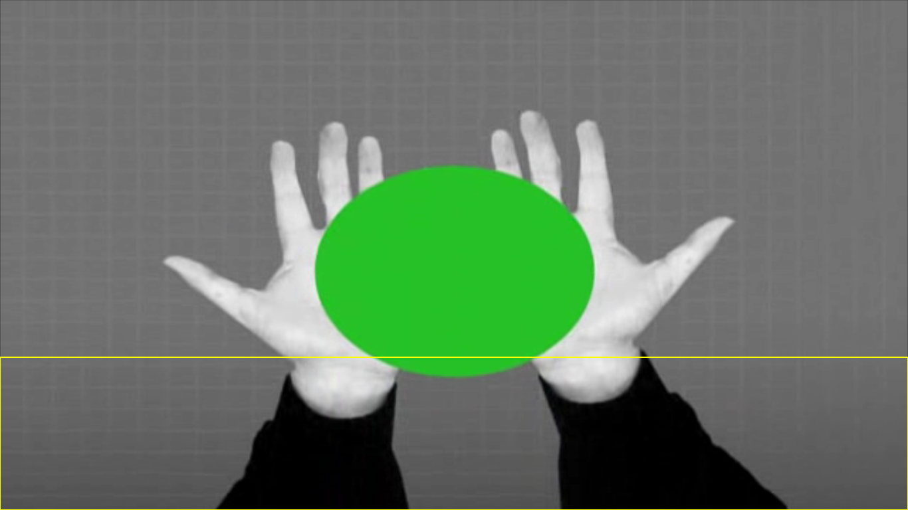

# RSS Reader — LuaRSS para TV Digital

> Leitor de RSS em NCLua que exibe notícias de um feed sobre um vídeo · Manoel Campos da Silva Filho (IFTO) · ~2010

## O que é
Aplicação de TV Digital Interativa escrita em NCL + Lua (NCLua) que funciona como um leitor de RSS. O `main.ncl` exibe um vídeo em tela cheia (`media/Wanna_Work_Together_-_Creative_Commons.avi`) e sobrepõe, no rodapé (região `rgLua`, 30% inferior da tela), uma faixa de Lua que baixa um feed RSS pela rede, faz o parse do XML (via biblioteca LuaXML) e apresenta as notícias uma a uma. O download usa a classe TCP do Ginga simulada com co-rotinas (`tcp.lua`), conectando-se na porta 80 e fazendo uma requisição HTTP GET; o feed padrão no código é `www.r7.com` (há hosts alternativos comentados como `g1.globo.com` e `rss.noticias.uol.com.br`). O telespectador navega entre as notícias pelo controle remoto e a tecla vermelha (RED) está mapeada para encerrar a mídia Lua.

## Como rodar
```bash
cd rss-reader
ginga main.ncl
```
Dica: adicione `-f` (tela cheia) ou `-s 960x540` (tamanho da janela).

## O que você deve ver
O vídeo de fundo em execução, com a região da faixa de notícias renderizada no rodapé. A interface roda; o conteúdo das notícias depende de baixar com sucesso um feed RSS pela rede (host padrão `www.r7.com`), navegável pelo controle remoto.



## Status da verificação
Testado em **2026-06-24** · Ginga (Lua 5.3) · Ubuntu 22.04
- ✅ **Roda.** O vídeo de fundo aparece e a região da faixa de notícias (rodapé) é renderizada.
- Antes a aplicação crashava no carregamento do script Lua: `./tcp.lua:14: attempt to call a nil value (global 'module')`.
- Causa-raiz: o arquivo `tcp.lua` declara-se como módulo com `module 'tcp'` (linha 14). A função global `module()` foi removida no Lua 5.2+, e o Ginga atual embarca Lua 5.3; como `main.lua` faz `require "tcp"`, o erro ocorria logo no início e impedia a execução.
- Correção: foi adicionado o shim `compat.lua`, que reativa `module()`/`setfenv()`/`getfenv()`/`package.seeall` do Lua 5.1, e uma única linha no topo de `main.lua` — `require "compat"`. Detalhes em `docs/CODE-CHANGES.md`.

## Limitações conhecidas
- Observação honesta: a interface roda, mas o conteúdo das notícias depende de baixar um feed RSS pela rede (canal de retorno / HTTP na porta 80). O host padrão (`www.r7.com`) e os alternativos podem não responder mais no formato esperado, então a faixa de notícias pode vir vazia se o feed não responder corretamente.
- O app é da época do Lua 5.1; ele só funciona no Ginga atual (Lua 5.3) graças ao shim `compat.lua` carregado via `require "compat"` no topo de `main.lua`. Sem esse shim, o `module()` em `tcp.lua` volta a quebrar o carregamento (ver `docs/CODE-CHANGES.md`).

## Arquivos principais
- `main.ncl` — documento NCL principal: define regiões, descritores, o vídeo de fundo e a mídia Lua, além dos links de controle (tecla RED encerra).
- `main.lua` — lógica do leitor de RSS: baixa o feed, faz parse do XML, formata e exibe as notícias sobre o vídeo, e trata as teclas do controle remoto. Começa com `require "compat"`.
- `compat.lua` — shim de compatibilidade que reativa `module()`/`setfenv()`/`getfenv()`/`package.seeall` (removidos no Lua 5.2+) para que os scripts da época do Lua 5.1 carreguem no Ginga atual (Lua 5.3). Ver `docs/CODE-CHANGES.md`.
- `tcp.lua` — biblioteca de conexões TCP do Ginga usando co-rotinas; antes era o ponto exato da falha (`module 'tcp'` na linha 14), hoje resolvido pelo `compat.lua`.
- `LuaXML/` — biblioteca LuaXML (`xml.lua`, `handler.lua`) usada para fazer o parse do XML do feed RSS.
- `media/` — mídias do app: o vídeo de fundo `Wanna_Work_Together_-_Creative_Commons.avi` e ícones (`dir.png`, `esq.png`, `fechar.png`).
- `LEIAME.txt` — nota curta com o título e o link do artigo original do autor.
- `Leitor-RSS-TV-Digital-GingaNCL.png` — imagem de divulgação/ilustração do app (não é uma captura da execução nesta máquina).
